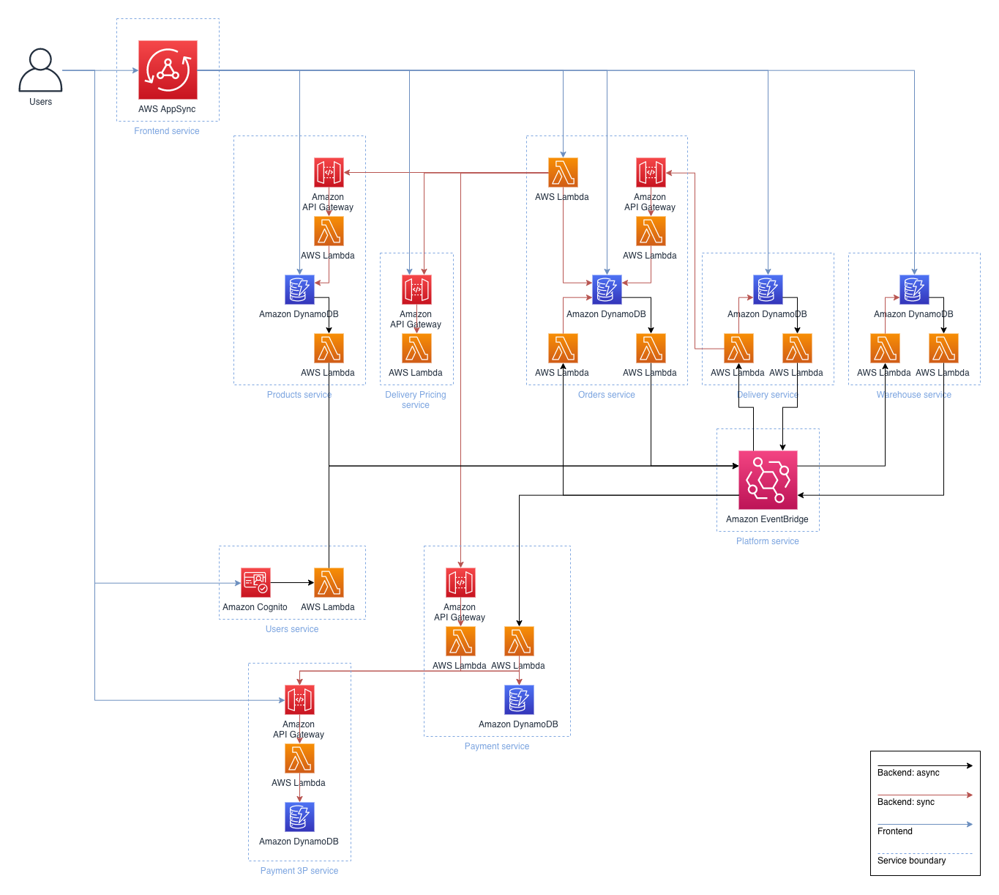

# 🛒 AWS Serverless E-commerce Platform

## 📌 Overview
The **Serverless E-commerce Platform** is a sample implementation of an **event-driven serverless backend** for an e-commerce application.  
It is designed around multiple **microservices** communicating through:
- **Asynchronous messaging** via [Amazon EventBridge](https://aws.amazon.com/eventbridge/)
- **Synchronous APIs** via [Amazon API Gateway](https://aws.amazon.com/api-gateway/)

> ⚠️ **Note:** This is **not** a production-ready e-commerce platform.  
> Instead, it serves as an **inspiration** for building **scalable, serverless, event-driven microservices** on AWS.

---

## 🚀 Getting Started
To set up and deploy this project to your AWS account, follow the [Getting Started Guide](docs/getting_started.md).

---

## 🏗 Architecture

### **High-Level Architecture**

  

---

## 🛠 Technologies Used

### **Communication / Messaging**
- [AWS AppSync](https://aws.amazon.com/appsync/) – User interaction with the platform.
- [Amazon API Gateway](https://aws.amazon.com/api-gateway/) – Service-to-service synchronous communication.
- [Amazon EventBridge](https://aws.amazon.com/eventbridge/) – Event-driven asynchronous communication.

### **Authentication / Authorization**
- [Amazon Cognito](https://aws.amazon.com/cognito/) – User management & authentication.
- [AWS IAM](https://aws.amazon.com/iam/) – Fine-grained access control.

### **Compute**
- [AWS Lambda](https://aws.amazon.com/lambda/) – Serverless compute for APIs & event processing.

### **Storage**
- [Amazon DynamoDB](https://aws.amazon.com/dynamodb/) – NoSQL database for scalable storage.

### **CI/CD**
- [AWS CloudFormation](https://aws.amazon.com/cloudformation/) & [AWS SAM](https://aws.amazon.com/serverless/sam/)
- [AWS CDK](https://aws.amazon.com/cdk/) – Infrastructure as Code.
- [AWS CodeCommit](https://aws.amazon.com/codecommit/) – Source control.
- [AWS CodeBuild](https://aws.amazon.com/codebuild/) – Build & test automation.
- [AWS CodePipeline](https://aws.amazon.com/codepipeline/) – Deployment automation.

### **Monitoring**
- [Amazon CloudWatch](https://aws.amazon.com/cloudwatch/) – Logs, metrics, dashboards.
- [AWS X-Ray](https://aws.amazon.com/xray/) – Distributed tracing.

---

## 📦 Microservices

| Service | Description |
|---------|-------------|
| [users](users/) | Manages user accounts, authentication, and authorization. |
| [products](products/) | Stores and manages product data. |
| [orders](orders/) | Handles order creation and tracking. |
| [warehouse](warehouse/) | Manages inventory and packaging. |
| [delivery](delivery/) | Handles shipment and package tracking. |
| [delivery-pricing](delivery-pricing/) | Calculates delivery costs. |
| [payment](payment/) | Manages payments and refunds. |
| [payment-3p](payment-3p/) | Simulates a third-party payment processor. |

---

## 🎯 Frontend Service

| Service | Description |
|---------|-------------|
| [frontend-api](frontend-api/) | User-facing API for interacting with backend services. |

---

## ⚙️ Infrastructure Services

| Service | Description |
|---------|-------------|
| [pipeline](pipeline/) | CI/CD pipeline for automated deployments. |
| [platform](platform/) | Core infrastructure for deploying backend services. |

---

## 📚 Shared Resources
- **[docs](docs/)** – Documentation for all services.
- **[shared](shared/)** – Common resources (CloudFormation templates, OpenAPI schemas).
- **[tools](tools/)** – Developer tools & utilities.

---

## 📖 Documentation
Detailed documentation is available in the [docs folder](docs/).
